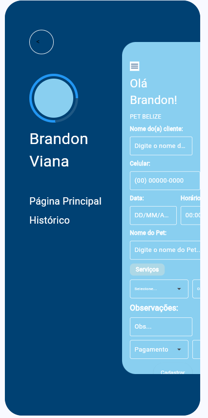
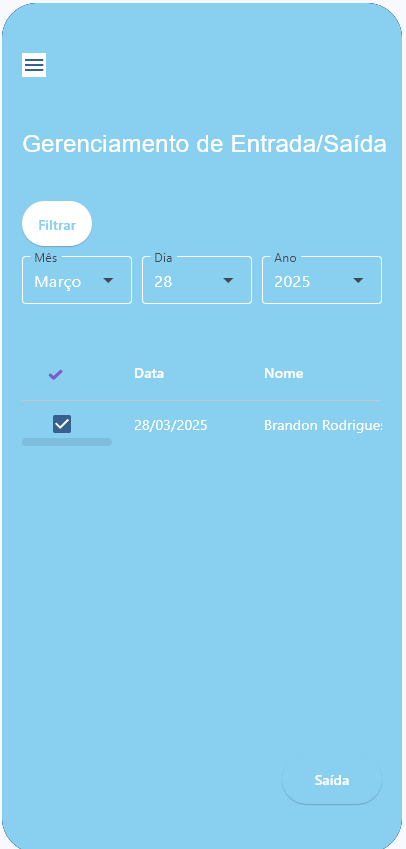

# Cadastro de Clientes Pet Belize 🐾

Um sistema para cadastro de clientes e pets, facilitando a gestão de atendimentos.

## 🚀 Tecnologias Usadas
- Python
- Flet
- Render (Deploy)

## Como rodar o projeto
1. Clone o repositório:  
   ```sh
   git clone https://github.com/BrandonViana/Cadastro_clientes_pet_python_flet
2. Instale as dependências:
    ```sh
    pip install -r requirements.txt
3. Rode o projeto:
    ```sh
    python app.py

## Deploy
O sistema está rodando no link:
https://cadastro-clientes-pet-python-flet-3.onrender.com

## Observações
- O app ainda não está implementado no sistema Android
- App está sendo atualizado e correções serão lançadas em breve!

## 📸 Preview  

<p align="center">
  
  
  
</p>
